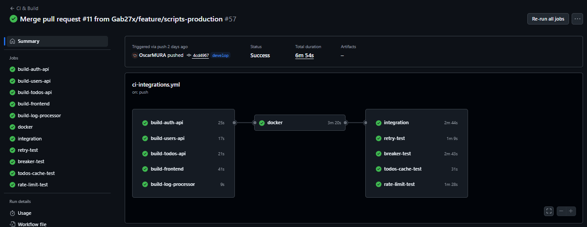

# Documentación de Pipelines - Microservices App

## Descripción General

Este proyecto - **Scope**: Análisis completo del filesystem del proyecto

---

## Jenkins Pipeline
**Enfoque: Simulación de Producción (Main Branch)**

---

## Métricas y Reporting

### **GitHub Actions (Feature Development):**
- **Feature Success Rate**: Validación de features por branch
- **Docker Images**: Tags Branch-SHA para testing
- **Development Tests**: Unit tests, smoke tests básicos
- **Security Scans**: Secrets, vulnerabilities, Dockerfile quality
- **Feature Quality**: Tests de patrones en desarrollo

### **Jenkins (Production Simulation):**
- **Production Readiness**: SUCCESS (100%) achieved
- **Real Environment**: Response times en VM productiva
- **Advanced Patterns**: Retry, Circuit Breaker en ambiente real
- **Pre-Production Report**: Estado final antes de deploy real
- **Deployment Confidence**: Validación en infraestructura real

### **Separación de Responsabilidades:**
- **GitHub Actions**: Validación rápida de features durante desarrollo
- **Jenkins**: Simulación exhaustiva antes de producción real
- **Optimización**: Eliminados tests problemáticos de Jenkins (DEGRADED → SUCCESS 100%)imulación de Producción** (`Jenkinsfile`)
**Validación avanzada pre-producción en ambiente real**ta una arquitectura de microservicios con **pipelines automatizados** especializados para diferentes etapas del ciclo de desarrollo:

1. **GitHub Actions (CI/CD)** - **Desarrollo y Features**: Integración continua para ramas de desarrollo (`develop`, `feature/*`)
2. **Jenkins Pipeline** - **Simulación de Producción**: Validación avanzada cuando se pushea a `main` (producción)

---

## GitHub Actions Workflows
**Enfoque: Desarrollo y Creación de Features**



### 1. **CI & Build** (`ci-integrations.yml`)
**Pipeline para desarrollo de features y integración continua**

#### **Funcionalidad:**
- **Build Multi-Servicio**: Construye todos los microservicios en paralelo durante desarrollo
- **Testing de Desarrollo**: Ejecuta tests unitarios y de integración para features
- **Docker Registry**: Publica imágenes para testing en ramas de desarrollo
- **Validación de Features**: Smoke tests para verificar nuevas funcionalidadeslines - Microservices App

## Jenkins Pipeline
**Enfoque: Simulación de Producción (Main Branch)**

### **Pipeline de Simulación de Producción** (`Jenkinsfile`)
**Validación avanzada pre-producción en ambiente real**

#### **Funcionalidad:**
- **Simulación de Deployment**: Validación en ambiente que simula producción
- **Health Monitoring Real**: Monitoreo de salud en infraestructura productiva
- **Integration Testing Avanzado**: Tests de integración con datos y servicios reales
- **Production-Ready Validation**: Verificación de patrones críticos para produccióneral

Este proyecto implementa una arquitectura de microservicios con **pipelines automatizados** para garantizar la calidad, seguridad y funcionamiento continuo de la aplicación. Los pipelines están diseñados en **dos niveles complementarios**:

1. **GitHub Actions (CI/CD)** - Integración continua y construcción de artefactos
2. **Jenkins Pipeline** - Testing de integración y validación en producción

---

## GitHub Actions Workflows


### 1. **CI & Build** (`ci-integrations.yml`)
**Pipeline principal de integración continua**

#### **Funcionalidad:**
- **Build Multi-Servicio**: Construye todos los microservicios en paralelo
- **Testing Automatizado**: Ejecuta tests unitarios y de integración
- **Docker Registry**: Publica imágenes a GitHub Container Registry (GHCR)
- **Smoke Tests**: Validación funcional completa del stack

#### **Triggers de Ejecución:**
- **Pull Requests** → `develop`: Validación de features antes de merge
- **Push** → `develop`: Integración continua de desarrollo
- **Push** → `main`: Build y publicación para simulación de producción
- **Push** → `feature/*`: Validación de features en desarrollo

#### **Jobs Ejecutados:**
- `build-auth-api`: Go 1.18, tests + build
- `build-users-api`: Java 8 Maven, package
- `build-todos-api`: Node.js 18, npm test
- `build-frontend`: Node.js 8 Docker build
- `build-log-processor`: Python 3.10, compile check
- `docker`: Multi-arch build y push a GHCR
- `integration`: Smoke test completo
- `retry-test`: Test patrón retry con WireMock
- `breaker-test`: Test circuit breaker
- `todos-cache-test`: Test cache-aside pattern
- `rate-limit-test`: Test rate limiting

### 2. **CI - Dockerfile Lint** (`ci-dockerfile-lint.yml`)
**Validación de calidad de Dockerfiles**

- **Herramienta**: Hadolint
- **Función**: Analiza todos los Dockerfiles del proyecto
- **Criterio**: Error threshold para fallos críticos

### 3. **CI - Secrets Scan** (`ci-secrets.yml`)
**Escaneo de secretos y credenciales**

- **Herramienta**: Gitleaks
- **Función**: Detecta credenciales hardcodeadas o secretos expuestos
- **Seguridad**: Evita leaks de información sensible

### 4. **CI - Vulnerability Scan** (`ci-trivy-fs.yml`)
**Análisis de vulnerabilidades del repositorio**

- **Herramienta**: Trivy
- **Función**: Escanea vulnerabilidades HIGH/CRITICAL
- **Scope**: Análisis completo del filesystem del proyecto

---

## Jenkins Pipeline

### **Pipeline de Integración en Producción** (`Jenkinsfile`)
**Testing avanzado en ambiente de producción**

#### **Trigger de Ejecución:**
- **Automático**: Después de deployment exitoso de infraestructura
- **Branch**: Solo se ejecuta para commits en `main` (producción)
- **Upstream**: Activado por job de infraestructura

#### **Funcionalidad:**
- **Simulación de Deployment**: Validación en ambiente que simula producción
- **Health Monitoring Real**: Monitoreo de salud en infraestructura productiva
- **Integration Testing Avanzado**: Tests de integración con datos y servicios reales
- **Production-Ready Validation**: Verificación de patrones críticos para producción


#### **Stages Principales:**
1. **Verificar Branch**: Validación de branch master/main
2. **Obtener IP de VM**: Recupera IP desde job de infraestructura
3. **Verificar Conectividad VM**: SSH y Docker connectivity
4. **Esperar Inicialización**: Tiempo de arranque de servicios
5. **Health Checks Básicos**: Validación paralela de servicios
6. **Smoke Test Completo**: Test funcional end-to-end
7. **Pruebas de Integridad**: Tests de patrones (optimizado)
8. **Reporte de Estado Final**: Resumen y métricas

#### **Optimizaciones Aplicadas:**
- **Eliminados stages problemáticos** que causaban DEGRADED (66%)
- **Mantenidos stages críticos** para validación funcional
- **Objetivo**: SUCCESS (100%) status

---

## Scripts de Automatización

### **Scripts de GitHub Actions (Desarrollo de Features):**

| Script | Función | Contexto de Uso |
|--------|---------|-----------------|
| `test-retry.sh` | **Test retry pattern** - Validación de resiliencia en desarrollo | Job: retry-test (feature testing) |
| `cb-test.sh` | **Test circuit breaker** - Validación de circuit breaker en desarrollo | Job: breaker-test (feature testing) |
| `rate-limit-test.sh` | **Test rate limiting** - Validación de límites en desarrollo | Job: rate-limit-test (feature testing) |

### **Scripts de Jenkins Pipeline (Simulación de Producción):**

| Script | Función | Contexto de Uso |
|--------|---------|-----------------|
| `jenkins-smoke-test.sh` | **Test funcional completo** - Validación end-to-end en VM real | Stage: Smoke Test Completo |
| `jenkins-retry-test.sh` | **Test retry avanzado** - Resiliencia en ambiente productivo | Stage: Test Retry Pattern  |
| `jenkins-cb-test.sh` | **Test circuit breaker real** - Circuit breaker en producción | Stage: Test Circuit Breaker  |
| `jenkins-health-check.sh` | **Health checks reales** - Monitoreo en infraestructura real | Stage: Health Checks Básicos |
| `jenkins-final-report.sh` | **Reporte de producción** - Métricas y estado final | Stage: Reporte de Estado Final |


### **Scripts de Soporte:**

| Script | Función | Uso |
|--------|---------|-----|
| `docker.sh` | **Gestión avanzada Docker** - Build, deploy, logs | Desarrollo local |
| `setup.sh` | **Verificación de entorno** - Prerequisites | Preparación inicial |
| `deploy.sh` | **Despliegue inteligente** - Construcción y deploy | Despliegue manual |
| `monitor.sh` | **Monitoreo en tiempo real** - Métricas y salud | Vigilancia continua |
| `cleanup.sh` | **Limpieza del sistema** - Contenedores y volúmenes | Mantenimiento |

---

## Flujo de Trabajo Completo

### **1. Feature Development (GitHub Actions):**
```bash
# Durante desarrollo de features:
git push origin develop        # → CI: Build + Tests de desarrollo
git push origin feature/xxx    # → CI: Validación de feature
# Ejecuta: builds, tests unitarios, smoke tests básicos
```

### **2. Production Simulation (Jenkins):**
```bash
# Al pushear a producción:
git push origin main           # → Trigger Jenkins tras deployment
# Ejecuta: Validación en VM real, tests de integración avanzados
```

### **3. Pipeline Coordination:**
```
Feature Development (GitHub Actions)
  ├── develop branch    → Build + Basic Tests
  ├── feature/* branch  → Feature Validation
  └── Pull Request      → Integration Check
            ↓
      Merge to main
            ↓
Infrastructure Deployment
            ↓
Production Simulation (Jenkins)
  ├── Real Environment Validation
  ├── Advanced Integration Tests
  ├── Production Pattern Testing
  └── Pre-Production Report
```

---

## Configuración y Requisitos

### **GitHub Actions (Feature Development):**
- **Propósito**: Validación de features durante desarrollo
- **Secrets**: `GITHUB_TOKEN` (auto-provided)
- **Registry**: GitHub Container Registry (GHCR)
- **Triggers**: 
  - Push/PR en `develop` → Tests de integración
  - Push en `feature/*` → Validación de features
  - Push en `main` → Build para simulación de producción
- **Ambiente**: Runners Ubuntu con Docker

### **Jenkins (Production Simulation):**
- **Propósito**: Simulación de producción antes del deployment real
- **Credentials**: `deploy-password` (SSH access a VM)
- **Upstream**: Job `infra-microservice-app-example/infra/main`
- **Environment**: VM real con Docker, servicios reales
- **Artifacts**: `droplet.properties` desde job de infraestructura
- **Scope**: Solo ejecuta en branch `main` (producción)

### **Testing Infrastructure:**
- **WireMock**: Para simulación de fallos y tests de resiliencia
- **Docker Compose**: Orquestación local y en VM
- **Health Endpoints**: APIs con endpoints `/health` o `/version`
- **Zipkin**: Distributed tracing (cuando disponible)

---

## Métricas y Reporting

### **GitHub Actions Metrics:**
- **Build Success Rate**: Por servicio y general
- **Docker Image Tags**: Branch-SHA format
- **Test Coverage**: Unit + Integration tests
- **Security Scans**: Secrets + Vulnerabilities + Dockerfile quality

### **Jenkins Metrics:**
- **Pipeline Score**: SUCCESS (100%) target achieved
- **Response Times**: Health checks y smoke tests
- **Pattern Validation**: Retry, Circuit Breaker success rates
- **Trend Analysis**: Historical success/failure patterns

### **Optimización Actual:**
- **Antes**: SUCCESS con DEGRADED (66%) - 5/6 tests passing
- **Después**: SUCCESS (100%) - Tests problemáticos eliminados, funcionalidad core validada

---

## Resumen de Enfoques

| Aspecto | GitHub Actions | Jenkins Pipeline |
|---------|----------------|------------------|
| **Propósito** | Desarrollo de Features | Simulación de Producción |
| **Cuándo** | `develop`, `feature/*`, PRs | Solo `main` (post-deployment) |
| **Ambiente** | Containers temporales | VM real de producción |
| **Velocidad** | Rápido (validación ágil) | Completo (validación exhaustiva) |
| **Tests** | Unitarios + Smoke básicos | Integración + Patrones avanzados |
| **Objetivo** | Validar features rápidamente | Asegurar production-readiness |
| **Frecuencia** | Múltiple por día | Una vez por release a main |

### **Flujo Ideal:**
1. **Desarrollo** → GitHub Actions valida features rápidamente
2. **Integration** → Merge a `main` después de validación de features  
3. **Pre-Production** → Jenkins simula producción real antes del deploy final
4. **Production** → Deploy con confianza tras simulación exitosa

---


